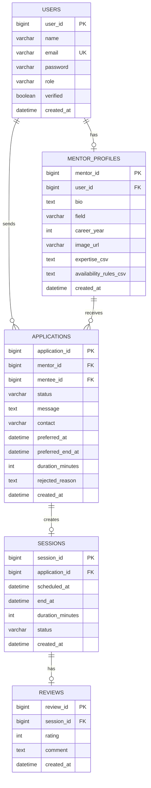

# MentorLink ERD

## 설계 요약

MentorLink는 `Application`을 중심으로 멘토링 신청, 승인, 세션 생성, 후기 작성이 이어지는 워크플로우를 갖습니다.  
핵심은 "신청" 데이터를 중심으로 이후 상태가 파생된다는 점입니다.

## ERD

## 엔티티별 역할

### User

- 공통 사용자 엔티티입니다.
- 이름, 이메일, 비밀번호, 역할, 인증 여부를 가집니다.
- 멘토와 멘티를 단일 사용자 테이블로 관리합니다.

### MentorProfile

- 멘토 전용 확장 정보입니다.
- 직무, 경력, 소개, 전문 분야, 예약 가능 시간을 저장합니다.
- `User`와 1:1 관계입니다.

### Application

- 서비스의 핵심 엔티티입니다.
- 멘티의 신청 의도, 상담 메시지, 연락처, 희망 일정, 상태를 모두 담습니다.
- 승인되면 세션이 생성되고, 완료되면 리뷰가 이어집니다.
- 실제 채용 플랫폼의 `지원`과 같은 역할을 수행합니다.

### Session

- 승인된 신청을 실질적인 상담 일정으로 확정한 엔티티입니다.
- 예정 시각, 종료 시각, 진행 상태를 관리합니다.

### Review

- 완료된 세션의 결과를 남기는 엔티티입니다.
- 멘토 상세 화면에 공개되는 후기 데이터의 원본입니다.

## 관계 설명

- 멘토 1 : N Application
  - 한 명의 멘토는 여러 신청을 받을 수 있습니다.
- 멘티 1 : N Application
  - 한 명의 멘티는 여러 멘토에게 신청할 수 있습니다.
- Application 1 : 1 Session
  - 승인된 신청은 최대 1개의 세션으로 이어집니다.
- Session 1 : 1 Review
  - 완료된 세션은 최대 1개의 후기를 가집니다.

## 설계 포인트

- 예약 가능 시간은 정규화 테이블 대신 `availability_rules_csv`에 저장하고, 애플리케이션 레이어에서 파싱합니다.
- 전문 분야 역시 `expertise_csv`로 저장해 3일 프로젝트 범위에서 구현 속도를 높였습니다.
- 반면 워크플로우 핵심인 `Application`, `Session`, `Review`는 별도 엔티티로 분리해 상태 전이와 트랜잭션을 명확히 표현했습니다.
